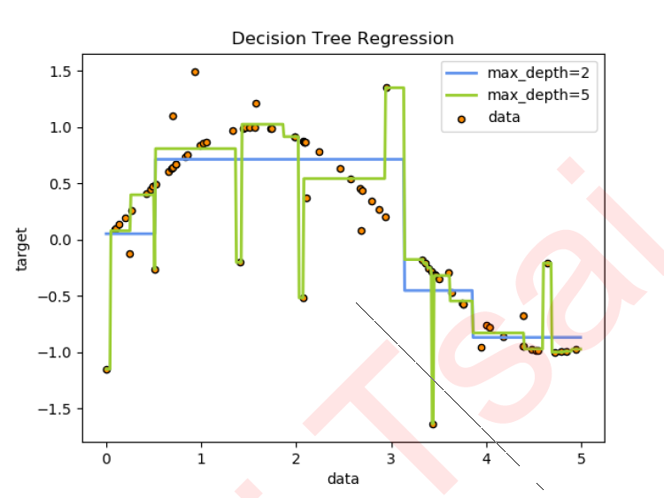

### 工具和技巧
1. graphviz 画出决策树
2. 超参数的学习曲线：以超参数的取值为横坐标，模型的度量指标为纵坐标的曲线，它是用来衡量不同超参数取值下模型的表现的线。

### 实验：
1. 各个超参数学习曲线：
    1. criterion: gini, entropy；
    2. max_depth

### 重点：
1. 原理
    1. 是什么？
    2. 工作流程
    3. 公式：熵(entropy), gini, info_gain, mse, mae,r2
2. 减少过拟合
3. 重要参数，以及调参经验
4. 优缺点

### 知识点：
1. 决策树介绍
2. sklearn 中分类决策树重要参数
    1. 不纯度指标：
        1. criterion： gini, entropy；怎样选取参数？
            1. 维度低，数据比较清晰的时候，信息熵和基尼系数没区别；
            2. 当决策树的拟合程度不够的时候，使用信息熵；
    1. 随机性：
        1. random_state：用来设置分枝中的随机模式的参数。
            1. 集成算法：一棵树不能保证最优，那就建更多的不同的树，然后从中取最好的。
            2. 怎样从一组数据集中建不同的树？在每次分枝时，不使用全部特征，而是随机选取一部分特征，从中选取不纯度相关指标最优的作为分枝用的节点。这样，每次生成的树也就不同了。
        2. splitter也是用来控制决策树中的随机选项的，有两种输入值，输入”best"，决策树在分枝时虽然随机，但是还是会优先选择更重要的特征进行分枝（重要性可以通过属性feature_importances_查看），输入“random"，决策树在分枝时会更加随机，树会因为含有更多的不必要信息而更深更大，并因这些不必要信息而降低对训练集的拟合
    2. 剪枝参数：不加限制的情况下，一棵决策树会生长到衡量不纯度的指标最优，或者没有更多的特征可用为止。这样的决策树往往会过拟合。
        1. max_depth: 限制树的最大深度，超过设定深度的树枝全部剪掉
        2. min_samples_leaf 限定，一个节点在分枝后的每个子节点都必须包含至少 min_samples_leaf个训练样本，否则分枝就不会发生，或者，分枝会朝着满足每个子节点都包含min_samples_leaf个样本的方向去发生一般搭配max_depth使用，在回归树中有神奇的效果，可以让模型变得更加平滑。这个参数的数量设置得太小会引起过拟合，设置得太大就会阻止模型学习数据。
        3. min_samples_split限定，一个节点必须要包含至少min_samples_split个训练样本，这个节点才允许被分枝，否则分枝就不会发生。 
    3. 精修：max_features & min_impurity_decrease 一般max_depth使用，用作树的”精修“
        1. max_features限制分枝时考虑的特征个数，超过限制个数的特征都会被舍弃。
        2. min_impurity_decrease 限制信息增益的大小，信息增益小于设定数值的分枝不会发生。
    4. 目标权重参数：class_weight & min_weight_fraction_leaf 完成样本标签平衡的参数。
        1. class_weight：参数对样本标签进行一定的均衡，给少量的标签更多的权重，让模型更偏向少数类，向捕获少数类的方向建模。
        2. min_weight_fraction_leaf：这个基于权重的剪枝参数来使用。
3. sklearn 中回归决策树重要参数
    1. criterion：回归树衡量分枝质量的指标，支持的标准有三种：mse, friedman_mse, mae
        1. mse：均方误差mean squared error
            1. 
            2. 父节点和叶子节点之间的均方误差的差额将被用来作为特征选择的标准
            3. 这种方法通过使用叶子节点的均值来最小化L2损失
        2. friedman_mse：费尔德曼均方误差。
            1. 使用弗里德曼针对潜在分枝中的问题改进后的均方误差
        3. mae：绝对平均误差 mean absolute error。
            1. 这种指标使用叶节点的中值来最小化L1损失
        4. 另外，回归树的接口 score 返回的是R平方，并不是MSE。 
            1. 
4. 交叉验证：用来观察模型的稳定性的一种方法。
    1. 我们将数据划分为n份，依次使用其中一份作为测试集，其他n-1份作为训练集，多次计算模型的精确性来评估模型的平均准确程度。
    2. 训练集和测试集的划分会干扰模型的结果，因此用交叉验证n次的结果求出的平均值，是对模型效果的一个更好的度量。
5. 决策树优点:
    1. 易于理解和解释，因为树木可以画出来被看见
    2.  需要很少的数据准备。其他很多算法通常都需要数据规范化，需要创建虚拟变量并删除空值等。但请注意，sklearn中的决策树模块不支持对缺失值的处理。
    3. 使用树的成本（比如说，在预测数据的时候）是用于训练树的数据点的数量的对数，相比于其他算法，这是一个很低的成本。
    4. 能够同时处理数字和分类数据，既可以做回归又可以做分类。其他技术通常专门用于分析仅具有一种变量类型的数据集。
    5. 能够处理多输出问题，即含有多个标签的问题，注意与一个标签中含有多种标签分类的问题区别开
    6. 是一个白盒模型，结果很容易能够被解释。如果在模型中可以观察到给定的情况，则可以通过布尔逻辑轻松解释条件。相反，在黑盒模型中（例如，在人工神经网络中），结果可能更难以解释。
    7. 可以使用统计测试验证模型，这让我们可以考虑模型的可靠性。
    8. 即使其假设在某种程度上违反了生成数据的真实模型，也能够表现良好。
6. 决策树的缺点
    1. 决策树学习者可能创建过于复杂的树，这些树不能很好地推广数据。这称为过度拟合。修剪，设置叶节点所需的最小样本数或设置树的最大深度等机制是避免此问题所必需的，而这些参数的整合和调整对初学者来说会比较晦涩
    2. 决策树可能不稳定，数据中微小的变化可能导致生成完全不同的树，这个问题需要通过集成算法来解决。
    3. 决策树的学习是基于贪婪算法，它靠优化局部最优（每个节点的最优）来试图达到整体的最优，但这种做法不能保证返回全局最优决策树。这个问题也可以由集成算法来解决，在随机森林中，特征和样本会在分枝过程中被随机采样。
    4. 有些概念很难学习，因为决策树不容易表达它们，例如 XOR，奇偶校验或多路复用器问题。
    5. 如果标签中的某些类占主导地位，决策树学习者会创建偏向主导类的树。因此，建议在拟合决策树之前平衡数据集。 

